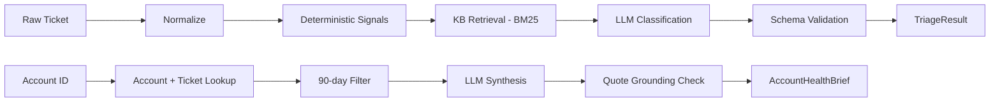

# Zycus AI Support — Ticket Triage & TAM Account Health

An AI-assisted support toolkit built for the US Delivery Internship technical
task round: an **intelligent ticket triage agent** for support engineers and
a **TAM account-health summariser** for account managers, both grounded in
the supplied synthetic dataset (500 tickets, 50 accounts, 8 knowledge-base
docs) with a real evaluation harness behind them.

Runs completely offline by default — **no API key required** to install,
test, demo, or evaluate.

---

## 1. Project overview

Two problems, one architecture:

- **Task 1 — Triage:** a support engineer pastes a raw ticket and gets back
  a structured classification (product / area / category / urgency),
  knowledge-base evidence, a recommended responder team, and a draft
  first-response — instead of manually reading, categorising, and searching
  docs for each of hundreds of daily tickets.
- **Task 2 — Account health:** a TAM enters an account ID and gets a
  3-section brief (executive summary, evidence-quoted risks, talking
  points) built from the account record and its last-90-days tickets —
  instead of the 30+ minutes of manual QBR prep the brief describes.

Both are backed by the same LLM-provider abstraction, the same knowledge
base retrieval index, and the same evaluation harness, so either pipeline
can be exercised via CLI, HTTP API, or pytest.

## 2. Architecture

```
Task 1 — Triage
Raw ticket (subject + body)
  → normalization
  → deterministic signal extraction (error-code regex, urgency keywords)
  → knowledge-base retrieval (BM25 over chunked markdown)
  → LLM reasoning/classification (mock or Anthropic)
  → Pydantic schema validation + enum-safe post-processing
  → TriageResult (classification, KB matches, routing, draft response)

Task 2 — Account health
account_id
  → account lookup (accounts.json)
  → 90-day ticket filter (tickets.json, fixed reference date, stable sort)
  → LLM synthesis (mock or Anthropic)
  → quote-grounding validation (every risk's quote checked against source text)
  → AccountHealthBrief (executive summary, risks, talking points)
```



### Repository layout

```
zycus-ai-support/
├── src/
│   ├── api/            # FastAPI app (/triage, /account-health, /health)
│   ├── agents/         # triage & account-health pipelines, LLM client, signals
│   ├── retrieval/      # markdown chunker + BM25 lexical index
│   ├── evaluation/     # scoring, dataset-derived test cases, runner
│   ├── models/         # Pydantic schemas (domain + output contracts)
│   ├── services/       # dataset loader (tickets.json / accounts.json)
│   ├── prompts/        # versioned prompt templates + CHANGELOG.md
│   ├── config/         # centralized settings (env-driven, no secrets)
│   └── utils/          # structured logging, prompt loader
├── data/                    # supplied tickets.json / accounts.json
├── knowledge-base/          # supplied markdown KB
├── tests/                   # pytest suite (48 tests)
├── examples/ticket.json     # sample CLI input
├── app.py                   # CLI entry point
├── eval_report.json/.md     # evaluation harness output
├── DESIGN.md                # Task 4 design note
└── requirements.txt
```

## 3. Features → assignment requirements map

| Assignment requirement | Where it lives |
|---|---|
| Raw ticket → structured triage (Task 1) | `src/agents/triage_agent.py`, `src/models/triage.py` |
| KB retrieval + known-issue matching | `src/retrieval/chunker.py`, `src/retrieval/index.py` |
| Routing + draft response | `triage_agent.py` (`Routing`, `DraftResponse`) |
| Callable function + REST endpoint | `run_triage()` / `POST /triage` |
| Account brief with 3 required sections (Task 2) | `src/agents/account_health_agent.py`, `src/models/account_health.py` |
| 90-day filter, graceful missing-account handling | `src/services/data_loader.py` |
| Quote-grounded risk flags, no fabricated quotes | `account_health_agent.py::_quote_is_grounded` |
| Deterministic output | fixed temperature=0, fixed reference date, stable sort (see §11) |
| Evaluation harness, ≥5 cases/task, adversarial cases | `src/evaluation/cases_task1.py`, `cases_task2.py`, `runner.py` |
| Quality scoring 0–1, pass/fail, report | `src/evaluation/scoring.py`, `eval_report.json` / `.md` |
| Design note (failure modes, latency, data, scaling) | `DESIGN.md` |
| No API key required to run | `LLM_PROVIDER=mock` default, see §6 |
| Prompt versioning | `src/prompts/*_v1.txt`, `src/prompts/CHANGELOG.md` |
| Security basics | `.env.example`, `.gitignore`, input validation (see §12) |

## 4. Dataset

Uses **only** the supplied synthetic dataset: `data/tickets.json` (500
records), `data/accounts.json` (50 records), and `knowledge-base/*.md` (8
docs). No external or scraped data is used anywhere in the pipeline or the
evaluation cases. One real, dataset-derived finding shaped the design:
**only 4 of 484 unique ticket `account_id`s actually resolve to an account
record** — so "account exists with zero linked tickets" is treated as the
*normal* case, not a rare edge case (see `t2_account_zero_tickets` in the
eval suite).

## 5. Setup

```bash
python -m venv .venv
source .venv/bin/activate        # Windows: .venv\Scripts\activate
pip install -r requirements.txt
```

No API key is needed for any of the steps below — the default provider is
`mock`.

## 6. Environment variables

Copy the template and edit locally (never commit the real file):

```bash
cp .env.example .env
```

| Variable | Default | Purpose |
|---|---|---|
| `LLM_PROVIDER` | `mock` | `mock` (offline, deterministic) or `anthropic` (real API calls) |
| `ANTHROPIC_API_KEY` | *(empty)* | Only required if `LLM_PROVIDER=anthropic` |
| `ANTHROPIC_MODEL` | `claude-sonnet-4-6` | Model used for real calls |
| `LLM_MAX_TOKENS` | `1500` | Output token cap for real calls |
| `REFERENCE_DATE` | `2026-05-22T00:00:00Z` | Fixes the "today" used for the 90-day account-health window, for reproducibility |
| `LOG_LEVEL` | `INFO` | Structured log verbosity |

**Switching providers:** set `LLM_PROVIDER=anthropic` and
`ANTHROPIC_API_KEY=sk-...` in your local `.env`, then re-run any command
below — no code changes needed. Switch back to `mock` any time; tests and
the eval harness always run against the mock provider regardless of your
`.env`, since they instantiate cases through the same pipeline functions
which default to `get_llm_client()` reading current settings. To force a
specific provider in code (e.g. for a one-off real-LLM demo), pass
`llm_client=AnthropicLLMClient()` explicitly to `run_triage` / `run_account_health`.

## 7. Running the application

```bash
# Triage a ticket from a file
python app.py triage --file examples/ticket.json

# Triage ad hoc text
python app.py triage --subject "Slow dashboard" --body "AnalyticsHub reports take 30s to load."

# Account health brief
python app.py account-health --account-id ACC-3336

# Run the evaluation harness
python app.py eval

# Run the API
python app.py serve
# then: curl http://localhost:8000/health
```

## 8. API examples

```bash
curl -X POST http://localhost:8000/triage \
  -H "Content-Type: application/json" \
  -d '{"subject": "Unable to connect DataBridge Pro", "body": "ERR_CONNECTION_TIMEOUT after 30s. 47 users affected."}'
```

```json
{
  "classification": {
    "product": "DataBridge Pro",
    "product_area": "...",
    "category": "Integration",
    "urgency": "P2",
    "reasoning": "..."
  },
  "knowledge_base": { "known_issue": true, "matches": [ ... ] },
  "routing": { "recommended_team": "Tier-1 Support", "reasoning": "..." },
  "response": { "draft": "..." }
}
```

```bash
curl -X POST http://localhost:8000/account-health \
  -H "Content-Type: application/json" \
  -d '{"account_id": "ACC-3336"}'
```

Real output from the mock pipeline for account `ACC-3336` (Omni Consumer
Products, health_status=`At Risk`):

```json
{
  "executive_summary": "Omni Consumer Products is currently marked 'At Risk' with a 'Inactive' usage trend. The account represents $500,000 in ARR on the Business plan. 1 ticket(s) were logged in the last 90 days, and 0 of those were P1. Existing escalation notes flag: 3 consecutive P1 tickets in the last 30 days; Decision maker considering competing vendor evaluation.",
  "risks": [
    {
      "risk_type": "Escalation note",
      "severity": "High",
      "explanation": "3 consecutive P1 tickets in the last 30 days",
      "supporting_ticket_id": "TKT-10293",
      "quote": "3 consecutive P1 tickets in the last 30 days"
    }
  ],
  "talking_points": [
    { "point": "Proactively address the account's health status and confirm ongoing pain points before renewal conversations.", "basis": "health_status=At Risk" }
  ]
}
```

Errors return standard HTTP codes: `400` business-rule-invalid input
(malformed `account_id`, whitespace-only ticket body), `422` schema
validation failure (missing/wrong-typed fields, e.g. a body that's an empty
string rather than whitespace — Pydantic rejects it before the handler
runs), `404` unknown account, `500` unhandled internal error (stack traces
are never returned to the caller).

## 9. CLI examples

```bash
python app.py triage --file examples/ticket.json
python app.py account-health --account-id ACC-2944   # Churning account
python app.py account-health --account-id ACC-00000   # unknown account, handled gracefully
python app.py eval
```

## 10. Evaluation

The harness (`src/evaluation/`) builds test cases from **real records** in
the supplied dataset (a real P1 ticket, a real Billing ticket, a real
Churning account, etc.) plus synthetic adversarial cases (prompt-injection
attempt, unknown account, empty ticket body). Scoring is rule-based /
schema-based throughout — no LLM-judge cost or non-determinism in the
eval loop itself (see `DESIGN.md` and `scoring.py` docstrings for the
weighting rationale).

Latest run (`eval_report.json`, mock provider):

| | Passed | Avg score |
|---|---|---|
| Task 1 — Triage | 8/8 | 0.9575 |
| Task 2 — Account health | 7/7 | 1.0 |
| Guardrails — adversarial "bad LLM" cases | 9/9 | 0.9 |
| **Overall** (mean of the three category averages) | 24/24 | **0.9525** |

Full per-case breakdown, including the specific component each case's score
is decomposed into, is in `eval_report.json` / `eval_report.md`. No case is
hidden from the report regardless of outcome — a lower Task 1 score (e.g.
`t1_integration_issue` at 0.8) reflects a genuine partial mismatch on a
non-primary scoring component, not a suppressed failure, and the guardrail
category's lowest scores (0.75) come from cases that intentionally degrade
gracefully rather than pass perfectly (see `eval_report.md`).

Run pytest for unit-level coverage (48 tests: signal extraction, retrieval,
data loading/filtering, both agent pipelines, schema validation, guardrails,
the eval harness itself, and the API):

```bash
pytest -q
```

## 11. Design decisions

- **Retrieval:** dependency-free BM25 over ~150 markdown chunks, not
  embeddings — deterministic, no extra infra, and well-suited to a
  vocabulary of exact product names/error codes (see `DESIGN.md` §2).
- **Determinism:** temperature fixed at 0 for both providers; account-health's
  90-day window is anchored to a configurable fixed reference date rather
  than `datetime.now()`; ticket ordering is stably sorted by
  `(-created_at, ticket_id)`. The mock provider is fully deterministic by
  construction; the Anthropic provider is only as deterministic as the
  underlying API guarantees at temperature 0, which is documented here as
  a known limitation rather than an unverified claim.
- **Never-fabricate quotes:** every Task 2 risk's `quote` field is checked
  to be a verbatim substring of its cited ticket or escalation note before
  being accepted; a risk with an unverifiable quote is dropped rather than
  passed through.
- **Untrusted input handling:** both prompts explicitly instruct the model
  to treat ticket/KB text as data, not instructions, and the adversarial
  eval cases include a direct prompt-injection attempt.

## 12. Security

- No API credentials anywhere in source, tests, or `README.md`.
- `.env` is git-ignored; `.env.example` ships only placeholder values with
  `LLM_PROVIDER=mock` as the default.
- `account_id` is validated against `^ACC-\d+$` at the API boundary before
  any lookup, closing off path-traversal-style or injection-style abuse of
  a user-controlled identifier.
- Structured logs record identifiers, counts, and latency only — never raw
  ticket/account content (see `src/utils/logging.py`).
- All external (LLM) boundaries are wrapped in exception handling that
  returns a generic 500 rather than leaking a stack trace.

## 13. Limitations

- The mock LLM client uses rule-based templates, not a real language
  model — it is a faithful, schema-identical stand-in for pipeline/eval
  development, not a claim of triage or summarisation *quality* equivalent
  to a real LLM. Quality claims (the 0.9525 eval score) describe the
  pipeline's correctness/reliability properties, not real-model output
  quality, since the eval was run against the mock provider.
- BM25 retrieval will miss KB matches that use different vocabulary from
  the ticket (a paraphrase problem embeddings would partially solve).
- Determinism for the Anthropic provider at temperature 0 is not a
  mathematical guarantee from the API — it's the best available lever, not
  a proof of reproducibility.
- No authentication/authorization layer on the API — out of scope for
  this assignment's mock dataset, but required before any real account
  data would be exposed this way.
- Account-health quote-grounding checks exact substring inclusion; minor
  LLM whitespace/punctuation drift on an otherwise-faithful quote would
  cause it to be dropped rather than repaired.

## 14. Production roadmap

- Swap the flat-file `DataStore` for a real datastore once ticket volume
  exceeds "fits comfortably in memory."
- Add PII redaction before any ticket/account text reaches an external LLM
  call, plus a documented data-retention policy.
- Add async/batched triage calls with rate-limit-aware concurrency for
  real throughput at scale (see `DESIGN.md` §4).
- Add authentication to the API and audit logging of who ran which
  account-health query.
- Add embeddings-based retrieval as a fallback for BM25 misses, keeping
  BM25 as the fast/deterministic first pass.
